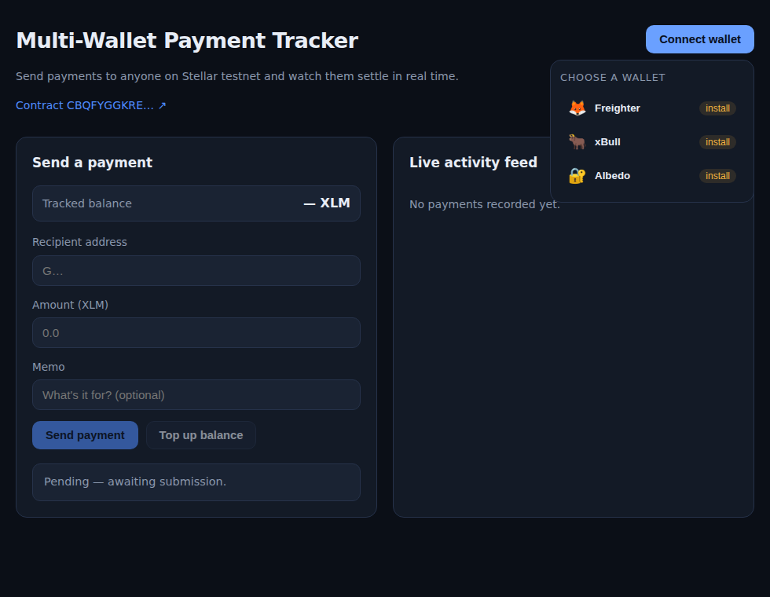

# Multi-Wallet Payment Tracker

A full-stack **Stellar / Soroban** dApp that lets users send payments to multiple
recipient addresses from any connected wallet (Freighter, xBull, or Albedo) and
watch each payment move through real-time status — `pending → submitting →
confirmed → failed` — plus a live activity feed of past payments pulled straight
from on-chain contract events.

Built as a Level 2 hackathon submission: smart contract, frontend, wallet
integration, testnet deployment, and documentation.

---

## Table of contents

- [Stack](#stack)
- [Architecture](#architecture)
- [Contract](#contract)
  - [Functions](#functions)
  - [Custom errors](#custom-errors)
- [Deployed contract (testnet)](#deployed-contract-testnet)
- [Real transaction](#real-transaction)
- [Frontend](#frontend)
  - [Wallet connect](#wallet-connect)
  - [Screenshots](#screenshots)
- [Setup](#setup)
  - [1. Prerequisites](#1-prerequisites)
  - [2. Build & test the contract](#2-build--test-the-contract)
  - [3. Deploy the contract](#3-deploy-the-contract)
  - [4. Run the frontend](#4-run-the-frontend)
- [Project structure](#project-structure)
- [Error handling](#error-handling)

---

## Stack

| Layer          | Technology                                                                 |
| -------------- | -------------------------------------------------------------------------- |
| Smart contract | Rust + [Soroban SDK](https://crates.io/crates/soroban-sdk) v27             |
| Frontend       | React 19 + TypeScript + Vite                                               |
| Wallet layer   | [Stellar Wallets Kit](https://www.npmjs.com/package/@creit.tech/stellar-wallets-kit) — multi-wallet (Freighter, xBull, Albedo) |
| Chain SDK      | [@stellar/stellar-sdk](https://www.npmjs.com/package/@stellar/stellar-sdk) v16 |
| Events/status  | Soroban RPC `getEvents` + `getTransaction` (live polling)                  |
| Network        | Stellar Testnet                                                            |

---

## Architecture

```text
┌───────────────────────────────────────────────────────────────────┐
│  Browser — React + TypeScript + Vite                              │
│                                                                   │
│   ┌────────────────┐   ┌──────────────┐   ┌─────────────────────┐ │
│   │ WalletConnect  │   │ PaymentForm  │   │ TxStatus            │ │
│   │ (3 wallets)    │   │              │   │ ActivityFeed        │ │
│   └───────┬────────┘   └──────┬───────┘   └─────────┬───────────┘ │
│           │ Stellar Wallets Kit                     │             │
│           │ (Freighter · xBull · Albedo)            │             │
└───────────┼────────────────────┼────────────────────┼─────────────┘
            │ SEP-43 sign tx     │ @stellar/stellar-sdk              │
            ▼                    ▼                    ▼             │
┌───────────────────────────────────────────────────────────────────┐
│  Soroban RPC (testnet) — simulateTransaction / sendTransaction     │
│                          getTransaction  / getEvents               │
└──────────────────────────────┬────────────────────────────────────┘
                               ▼
┌───────────────────────────────────────────────────────────────────┐
│  payment_tracker contract (Rust + Soroban SDK)                    │
│  record_payment · get_payment · list_payments · deposit           │
│  emits PaymentEvent(payment) on every successful payment          │
└───────────────────────────────────────────────────────────────────┘
```

Data flow: the user picks a wallet → the form builds a Soroban invocation →
`simulateTransaction` catches contract errors up front → the wallet signs the
transaction → `sendTransaction` submits it → `getTransaction` reports the final
status → `getEvents` powers the live feed without a page refresh.

---

## Contract

The contract maintains an internal tracked balance per address (topped up via
`deposit`), records payments between addresses, indexes them per user, and emits
a structured event on success.

### Functions

| Function                              | Description                                                              |
| ------------------------------------- | ------------------------------------------------------------------------ |
| `deposit(account, amount)`            | Credits tracked balance to `account` (requires the account's signature). |
| `record_payment(from, to, amount, memo)` | Moves tracked balance `from → to`, returns the new payment id, emits `PaymentEvent`. |
| `get_payment(id)`                     | Returns a single payment by id.                                          |
| `list_payments(address)`              | Returns every payment the address participated in.                       |
| `get_balance(address)`                | Returns an address's tracked balance.                                    |

### Custom errors

The contract uses a `#[contracterror]` enum with proper `Result` return types.
Each error is triggerable from the UI and covered by a unit test.

| Code | Variant               | Triggered when…                                      | User-facing message (frontend)                        |
| ---- | --------------------- | ---------------------------------------------------- | ----------------------------------------------------- |
| `1`  | `InsufficientBalance` | `from`'s tracked balance is less than `amount`        | "Insufficient balance — top up your tracked balance before sending this amount." |
| `2`  | `InvalidRecipient`    | `to == from` (self-payment)                           | "Invalid recipient — you cannot send a payment to yourself." |
| `3`  | `AmountTooSmall`      | `amount <= 0` (below `MIN_PAYMENT`)                   | "Amount too small — the amount must be greater than zero." |
| `4`  | `PaymentNotFound`     | `get_payment(id)` for an id that doesn't exist         | "Payment not found — no payment exists with that id." |

> `PaymentNotFound` is a bonus fourth error; the spec requires at least three.

---

## Deployed contract (testnet)

| Item            | Value                                                                                                 |
| --------------- | ----------------------------------------------------------------------------------------------------- |
| **Contract ID** | `CBQFYGGKREZHOCAIGSCWLV57ZDW5RLNXLVOQT34D46DQL4KIDZQDNXWH`                                              |
| Explorer        | [stellar.expert](https://stellar.expert/explorer/testnet/contract/CBQFYGGKREZHOCAIGSCWLV57ZDW5RLNXLVOQT34D46DQL4KIDZQDNXWH) |
| Wasm hash       | `1128842a062ab3370812e7fe67caff758c680f2934574b1d655441cc4a59d2a4`                                      |
| Deploy tx       | [01431fb5…](https://stellar.expert/explorer/testnet/tx/01431fb5c0bc550fd30627cd957c93737c919ba2dd16afeb77f6fb1ccd3bce15) |
| Deployer        | `GBFROEZUWZEVYOFUYIEJPS3EWYOE7HSUOUQRC4XN7HIYTRR2YWMPS5QB` (friendbot-funded)                            |

---

## Real transaction

A live `record_payment` call was made against the deployed contract after
topping up the deployer's tracked balance:

| Item        | Value                                                                                                   |
| ----------- | ------------------------------------------------------------------------------------------------------- |
| **Tx hash** | `b08426314d99865c6860c36dc748e366eab910bd82a48d0212b71910b384d91a`                                        |
| Explorer    | [stellar.expert/tx/b0842631…](https://stellar.expert/explorer/testnet/tx/b08426314d99865c6860c36dc748e366eab910bd82a48d0212b71910b384d91a) |
| `from`      | `GBFROEZUWZEVYOFUYIEJPS3EWYOE7HSUOUQRC4XN7HIYTRR2YWMPS5QB`                                                |
| `to`        | `GCLTSGHOLA6T643OZWC5XXGPDFF4DVITTBVHF755XJY4YKUM5N7ITF4L`                                                |
| `amount`    | `250000000` stroops (25 XLM)                                                                             |
| `memo`      | `coffee`                                                                                                 |

The call returned payment id `0` and emitted the event
`PaymentEvent(payment): id=0, amount=250000000, memo="coffee"`, verifiable via
RPC `getEvents` filtered by the contract ID (ledger `4205543`).

The supporting transactions:

- Deposit (top-up): [f2749e8b…](https://stellar.expert/explorer/testnet/tx/f2749e8bf092196ef8cc78281cf0c5666ec4af2d7764c2bf9c855889af9775b6)
- Wasm upload: [18222684…](https://stellar.expert/explorer/testnet/tx/18222684d46e230a0d3c2419fcb236b5b674ee86b476811048ecad8753f0b758)

---

## Frontend

### Wallet connect

The connect UI lists **three** wallets — not a single hardcoded provider:

- 🦊 Freighter
- 🐂 xBull
- 🔐 Albedo

Each option checks whether the wallet extension is installed and shows a
`detected` / `install` badge.

### Screenshots

Wallet options available on connect:



---

## Setup

### 1. Prerequisites

- [Rust](https://rustup.rs) with the `wasm32v1-none` target
- [Stellar CLI](https://developers.stellar.org/docs/build/smart-contracts/getting-started/setup) (`stellar` 27.x)
- Node.js 20+ and npm

```bash
rustup target add wasm32v1-none
```

### 2. Build & test the contract

```bash
cd contract
cargo test          # 8 tests: happy path + every error case
stellar contract build
# → target/wasm32v1-none/release/payment_tracker.wasm
```

### 3. Deploy the contract

The deploy script builds, obtains a funded testnet identity, deploys, and saves
the resulting contract ID:

```bash
cd contract
./deploy.sh
# → prints "✅ Contract deployed: C…"
# → saves it to contract/.contract-id
```

By default it generates and funds a fresh identity via friendbot. To use your
own funded key instead:

```bash
STELLAR_SECRET_KEY=S… ./deploy.sh
```

### 4. Run the frontend

The contract ID is configured in [`frontend/src/config.ts`](frontend/src/config.ts).

```bash
cd frontend
npm install
npm run dev        # http://localhost:5173
npm run build      # typecheck + production build
```

---

## Project structure

```text
/contract                          # Soroban contract
  /contracts/payment_tracker
    /src/lib.rs                    # data types, storage, functions, events, errors
    /src/test.rs                   # unit tests (happy path + 4 error cases)
    Cargo.toml
  deploy.sh                        # testnet deploy script
  .contract-id                     # deployed contract id (testnet)
/frontend                          # React app
  /src
    /lib/contract.ts               # contract call wrappers + event polling
    /lib/wallet.ts                 # Stellar Wallets Kit setup
    /lib/errors.ts                 # contract error → message mapping
    /components/
      WalletConnect.tsx            # multi-wallet connect UI
      PaymentForm.tsx              # recipient + amount + memo form
      TxStatus.tsx                 # pending/submitting/confirmed/failed
      ActivityFeed.tsx             # live feed from getEvents
      Toasts.tsx                   # toast notifications
      ErrorBoundary.tsx            # prevents UI crashes
  /src/config.ts                   # contract id, RPC url, network
/docs
  wallet-options.png               # wallet connect screenshot
README.md
```

---

## Error handling

- Every contract call is simulated first; a `#[contracterror]` failure surfaces
  as `HostError: Error(Contract, #N)` and is decoded to its numeric code.
- Codes are mapped to distinct, human-readable messages in
  [`frontend/src/lib/errors.ts`](frontend/src/lib/errors.ts).
- Failed states render the decoded message inline and raise a toast; a React
  error boundary catches anything unexpected so the UI never crashes.
